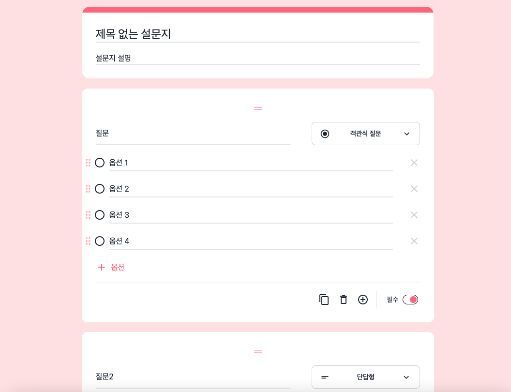
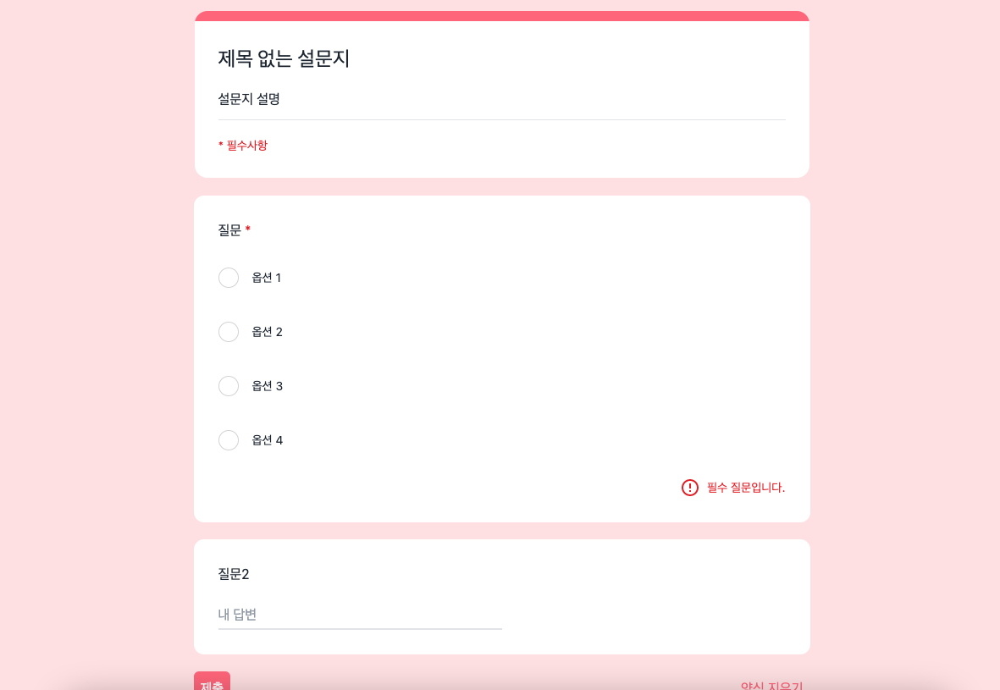
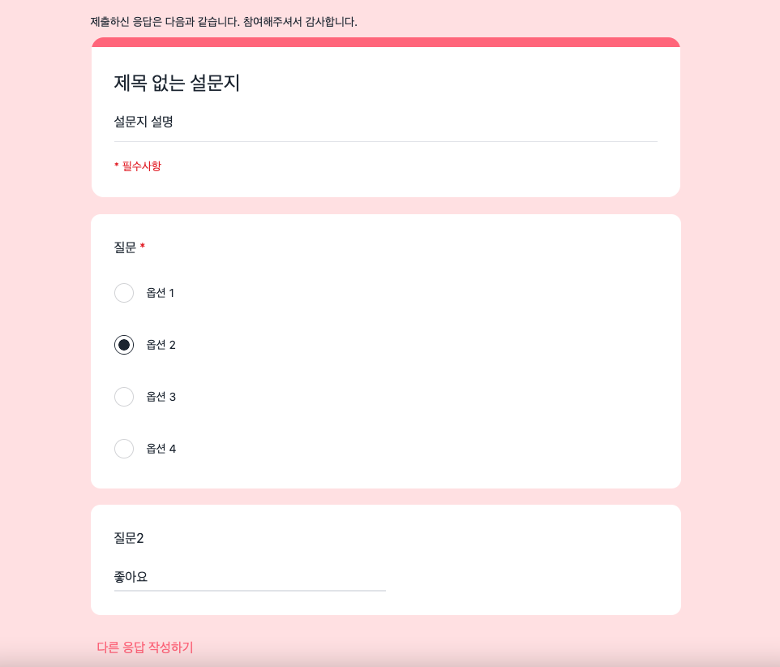

# Google Form (구글 폼)

## 목차
1. [배포 링크](#배포-링크)
2. [기술 스택](#기술-스택)
3. [About project](#about-project)
4. [실행 방법](#실행-방법)
5. [디렉토리 구조](#디렉토리-구조)

## 배포 링크
- https://custom-surveys.chloemin.com
<br/>
<br/>

## 기술 스택
- React 18 + TypeScript
- React Router
- Redux (redux-toolkit)
- CSS Framwork: Tailwind CSS, daisyUI
<br/>

## About project
1. 구글 폼 만들기

2. 기능 구현  
        - 질문 추가, 편집, 복사, 삭제, 순서 변경 기능  
        - 응답 미리 보기, 양식 지우기, 제출 하기 기능  

3. 프로젝트 구성  
        - 관심사를 기준으로 컴포넌트 분리, 상태 관리 디렉토리 구성  
        - AWS S3, CloudFront를 통한 정적 웹사이트 배포, Github Action을 통한 배포 자동화 처리  
        - 상태 관리, 컴포넌트 렌더링 단위 테스트

4. 서비스 화면 미리보기  
        - 메인 페이지 (Create)
    
<br/>  
        - 미리보기 페이지 (Preview)
    
<br/>  
        - 제출 페이지 (Submit)
    
<br/>

## 실행 방법
1. repository clone
    ```
    $ git clone https://github.com/MINYUKYUNG/custom-surveys.git
    ```
    
2. dependencies install
    ```
    npm install
    ```
    
3. project start
    ```
    npm run start
    ```
<br/>

## 디렉토리 구조
| 디렉토리 | 구분 |
| -- | -- |
| assets | font, images, json 등 로컬 파일 디렉토리 |
| components | 공통 컴포넌트 파일 디렉토리 |
| constants | 전역적으로 사용하는 상수 파일 디렉토리 |
| pages | url 주소 페이지 파일 디렉토리 |
| routes | 리액트 라우팅 파일 디렉토리 |
| store | 전역상태관리 파일 디렉토리 |
| utils | 중복 로직 함수를 순수 함수화한 파일 디렉토리 |
<br/>

